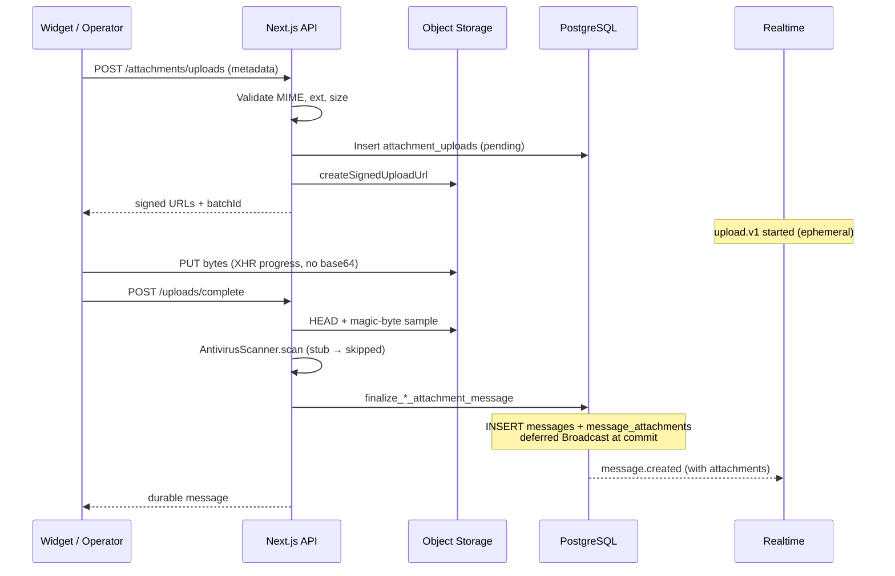

# Attachments Architecture (PR #24)

**Status:** Implemented  
**Bucket:** private `attachments` (never public)  
**Storage port:** `ObjectStorage` (`packages/shared/src/storage`) with Supabase adapter

---

## Upload flow

**Durability rule:** `messages` rows are created only in `finalize_*` after object validation. Failed/cancelled uploads never create ghost messages.

**Partial multi-file failure:** A batch is atomic at finalize — all files in the batch must upload and validate before a message is created. If any PUT fails mid-batch, the client cancels the batch (deletes remaining intents + uploaded objects) and no durable message is created. Retry starts a new batch with new object keys (idempotent via `client_message_id` only after a successful finalize).

---

## Storage design

| Concern | Design |
|--------|--------|
| Path | `{workspace_id}/{conversation_id}/{attachment_id}/{safe_filename}` |
| Access | Signed upload + signed download only (no authenticated Storage SELECT) |
| Upload TTL | Supabase upload tokens are fixed at **2 hours**; app enforces `attachment_uploads.expires_at` (default 30 min intent / 10 min advertised) on complete |
| Download TTL | Signed download URLs expire in **15 minutes** (server-enforced) |
| Bucket | Private; no anon/authenticated object policies |
| Abstraction | `ObjectStorage` interface — Supabase today, S3-compatible later |
| Thumbnails | Supabase image transforms via signed URL `variant=thumbnail` |
| Orphans | Cancel + failed-finalize delete objects; expired pending intents indexed by `expires_at` for a future cleanup job (not yet scheduled) |

---

## Data model

`message_attachments`: id, message_id, workspace_id, conversation_id, storage_key, mime_type, filename, size_bytes, kind, width, height, duration_ms, thumbnail_storage_key, scan_status, sort_order, metadata_json, timestamps.

`attachment_uploads`: pending intents keyed by `batch_id` until confirm/cancel/expiry.

RLS: workspace members SELECT attachments for accessible non-internal messages; upload intents are service-role only.

---

## Realtime

| Event | Topic | Authority |
|------|-------|-----------|
| `upload.v1` started/completed/failed/cancelled | `widget-ephemeral:{key}` | Ephemeral UX only |
| `message.created` (+ attachments[]) | `widget-conversation:{key}` | Durable (DB trigger, deferred) |
| Operator CDC | `workspace:{id}:inbox` | `metadata_json.attachments` + list catch-up |

Message ordering preserved via `sequence_number`. Idempotent via `client_message_id`. Reconnect uses HTTP catch-up (`afterSequence`).

---

## Security review

| Risk | Mitigation |
|------|------------|
| XSS via filename | Sanitize; render as text; Content-Disposition attachment |
| HTML / SVG script | Reject `image/svg+xml`, `text/html`, executables |
| MIME spoofing | Magic-byte verification on complete |
| Public bucket leakage | Bucket `public=false`; no anon upload policies |
| Signed URL expiry | Download 15m (enforced); upload token ≤2h (Supabase); intent expiry enforced on complete |
| Ghost messages | Finalize after storage validation only |
| Confirmed re-complete | Idempotent via `client_message_id`; never deletes confirmed objects |
| Antivirus | `AntivirusScanner` port; stub returns `skipped` (UI never claims a file was scanned) |
| Cancel scope | Cancel requires visitor session or operator member ownership |

---

## Performance notes

- Direct-to-storage uploads (no base64, no server proxy of bytes)
- XHR upload progress; AbortController cancel
- Lazy-loaded image previews; progressive opacity
- Aspect ratio reserved via stored width/height
- Magic-byte window ≤4 KiB download, not full object

---

## Limits (configurable)

| Kind | Default |
|------|---------|
| Images | 20 MB |
| Documents | 50 MB |
| Files / message | 10 |

Plan overrides can replace `AttachmentLimitConfig` later.

---

## API (backward compatible)

Widget (new):

- `POST /api/v1/widget/attachments/uploads`
- `POST /api/v1/widget/attachments/uploads/complete`
- `POST /api/v1/widget/attachments/uploads/cancel`
- `GET /api/v1/widget/attachments/:id/download`

Operator:

- Server Actions: initiate / complete / cancel uploads
- `GET /api/v1/inbox/attachments/download`

Existing text send routes unchanged. Message payloads gain optional `attachments: []`.
